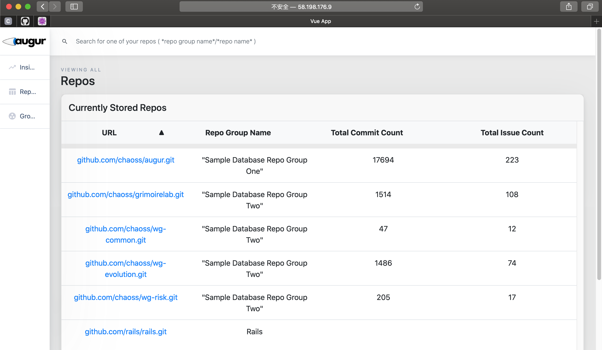

# Chaoss-Microtasks
This repository contains the microtask submissions for CHAOSS GSoC 2020. I want to work on the idea: **[Machine Learning for Anomaly Detection in Open Source Communities](https://github.com/chaoss/augur/issues/545)**. I also have some new ideas want to share with others in Augur community.

-  **Microtask 0:** Familiarize yourself with augur by downloading and configuring the dev branch. For a little more context about what we are trying to accomplish with Augur's prototyping, checkout Augur's documentation at : https://oss-augur.readthedocs.io/en/dev/ Fork Augur into your own GitHub Account. Work in the dev branch.

  

-  **Microtask 1:** Using any machine learning algorithm or library you are comfortable experimenting with, identify data anomalies in the commits, pull_requests, issues, or "messages" tables. The database structure is in the documentation noted above. You would choose "messages" if you have a particular interest in computational linguistics oriented machine learning. You do not need to build your analysis as a worker.
  - I worked in dev branch follow the instruction and added a notebook to work with augur example data. Apart from this, I mined the Augur repositories commit log and visualized the collaboration network. Then run community detection algorithm on it.

-  **Microtask 2:** Make a pull request to update the dev branch with the work from Microtask 1. If you have questions about getting started in the steps above, open an issue in the Augur repository.
  - issue：https://github.com/chaoss/augur/issues/631
  - PullRequst：https://github.com/chaoss/augur/pull/662